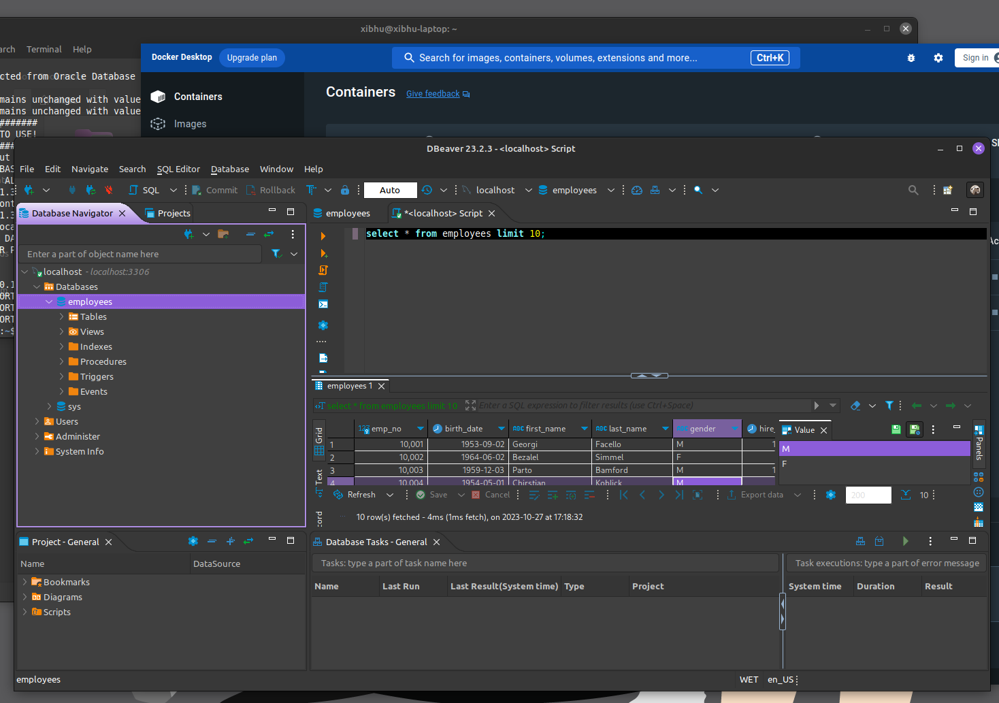
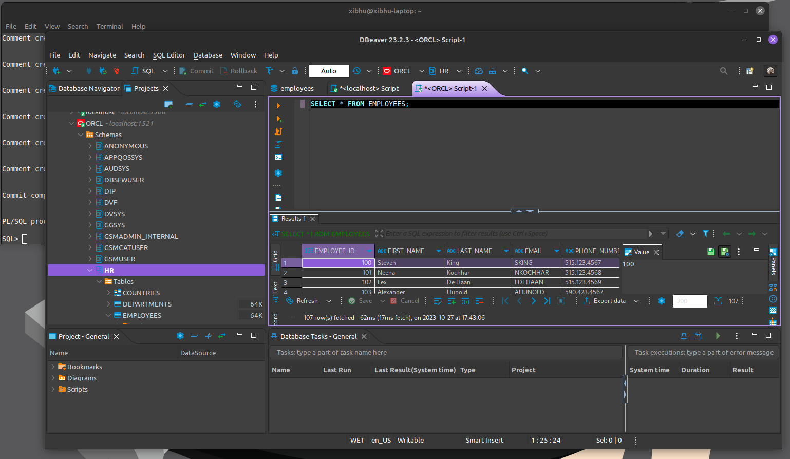

# Ejercicio 1

## Carlos Marrero Ramos

# Instalación de Docker en Linux

Para utilizar Docker en Linux se puede utilizar únicamente con terminal o junto a una interfaz.

En cualquier caso es requisito imprescindible instalar primero docker-engine a través de las instrucciones de la [página web](https://docs.docker.com/engine/install/ubuntu/) y haciendo uso de la tercera opción de instalación, el script automatizado.

Una vez instalado docker-engine se tienen las dependencias necesarias para instalar docker-desktop, el cual se instala a través de un paquete deb desde [aquí](https://www.docker.com/products/docker-desktop/).

Se debería poder instalar docker-desktop sin el engine, pero en los repositorios no están las dependencias necesarias. Es por ello que la instalación del engine a través del script satisface las dependencias y permite la instalación de desktop.

# Advertencias previas

El uso conjunto o separado del engine por terminal y desktop da lugar a una situación inesperada e inconveniente.

En docker existen los "context", son instancias donde se almacenan las imágenes y contenedores. Al instalar el engine se crea una por defecto "default". Mientras que cuando se instala desktop se crea "desktop-linux".

Cuando se ejecuta por terminal el engine, está en "default".

Cuando se ejecuta desktop, está en "desktop-linux".

Cuando están los dos a la vez, independientemente del orden de inicio, el terminal de engine pasa automáticamente a "desktop-linux".

Sin embargo, el caso contrario es imposible de darse, ya que el context de desktop es especial, el programa está montado sobre una máquina virtual y no permite cambiar a otros. Si se fuerza, el programa dejará de funcionar.

Por lo que desde desktop solo se puede trabajar en "desktop-linux". Desde engine se puede trabajar en cualquiera. Esto puede generar inconsistencias en el tipo de uso, ya que si se desea utilizar solo la terminal pero haciendo uso esporádico de la interfaz, siempre deberá estar abierto desktop y usando "desktop-linux". Ya que este es el limitante en la pareja.

Una posible solución es exportar e importar entre context si fuera necesario.

El uso que se dará en los ejercicios será de ambos abiertos, con "desktop-linux", pero usando exclusivamente la terminal. Por incertidumbre de si fuera necesario utilizar alguna característica exclusiva de desktop en algún ejercicio.

# Consideraciones

Si se quisiera usar exclusivamente docker mediante terminal con sus context, entonces se deberá crear e incluir el usuario en el grupo de docker.

Crear.

    sudo groupadd docker

Incluir.

    sudo usermod -aG docker ${USER}

Con ello se podrá usar docker sin usar sudo y se podrá empezar por el contenedor de ejemplo.

    docker run hello-world

# Uso de Docker

Se debe descargar primero la imagen del programa necesario, en este caso mysql.

    docker pull mysql

Una vez descargada la imagen se debe instalar en un nuevo contenedor.

    docker run -p 3306:3306 --name bbdda-mysql -e MYSQL_ROOT_PASSWORD=mysql -d mysql:latest

Al terminar la instalación el contenedor existirá, pero no está ejecutado ni tenemos información de todos los que hay instalados. Se pueden ver todos los contenedores instalados y sus nombres.

    docker ps -a

O bien

    docker container ls -a

Si se quisiera conocer el ID de un contenedor.

    docker inspect --format='{{.Id}}' NOMBRE_CONTENEDOR

Para iniciar el contenedor.

    docker container start bbdda-mysql

Para detener el contenedor.

    docker container stop bbdda-mysql

Para iniciar una terminal dentro del contenedor.

    docker exec -it NOMBRECONTENEDOR bash

Si se quisiera copiar una carpeta desde el sistema host al contenedor. En CONTAINERID se puede colocar el nombre del contenedor.

    docker cp Downloads/test_db-master CONTAINERID:/employees

# MySQL

En mysql, para ejecutar un archivo sql.

    mysql -u root -p < employees.sql

# Oracle

Una vez descargado el archivo ZIP de Oracle Database, copiado en la carpeta "docker-images-main/OracleDatabase/SingleInstance/dockerfiles" y ejecutado el script "./buildContainerImage.sh -v 19.3.0 -e" entonces se crea la imagen en el context de docker engine activo. Por lo que es recomendable tenerlo en "desktop-linux" si se quiere utilizar también en la interfaz.

Seguir los pasos descritos en la actividad sin inconvenientes.

