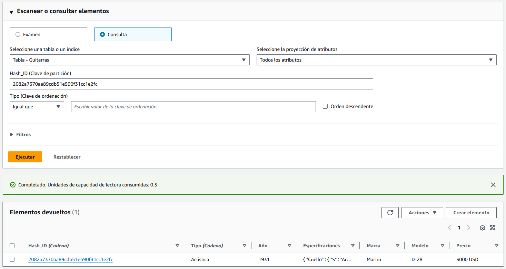

# DynamoDB

## 1. Ejercicio

### Parte I) Creación de la tabla desde la consola de AWS

Se ha creado la tabla Seguimiento_Fitness que contiene las siguientes claves:

- **Clave de partición**: contendrá un Hash MD5 del modelo y la marca.
- **Clave de ordenación**: compuesta por el tipo.

<i>Tabla "Seguimiento_Fitness"</i>

### Parte II) Inserta datos en la tabla

Hemos introducido datos en nuestra tabla siguiendo el siguiente patrón:

- **Primary Key (Compuesta)**:
  - **Clave de Partición (PK)**: Hash_ID
  - **Clave de Ordenación (SK)**: Tipo
- **Atributos adicionales**:
  - Año.
  - Actividades (cuerpo, cuello, trastes, pastillas, puente...).
  - Marca.   
  - Modelo.
  - Precio.

<i>Elementos de la tabla</i>

### Parte III) Crea algún índice GSI

<i>Índices de la tabla</i>

### Parte IV) Realiza operaciones de lectura.

#### Examen

<i>Resultado de la realización de un Scan de la tabla</i>

#### Consulta

<i>Resultado de la consulta con todos los atributos</i>
