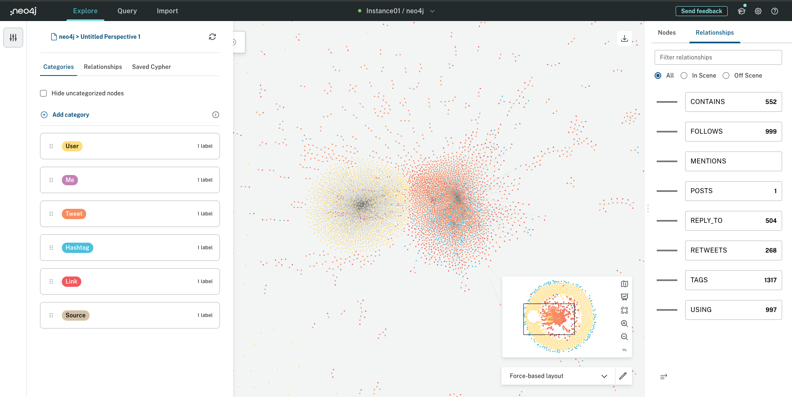
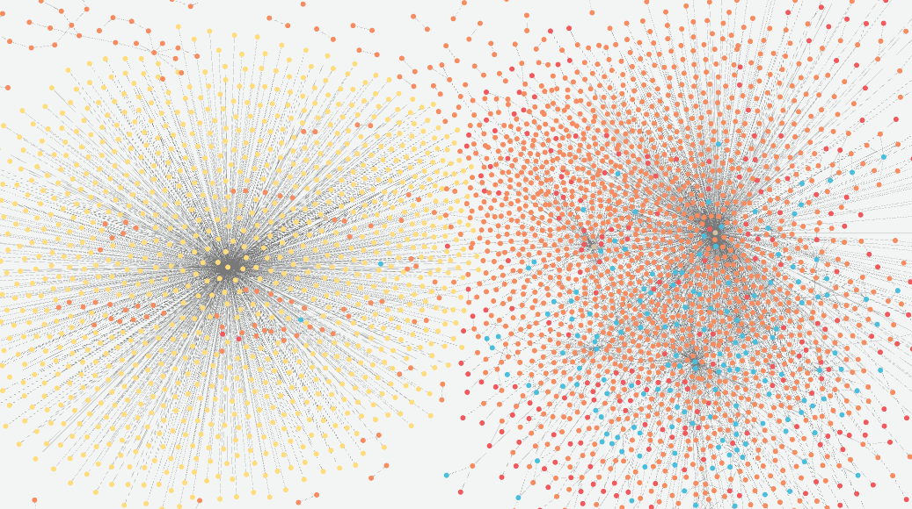

# Neo4j

## 1. Ejercicio

Para explorar con Neo4j me he descargado el último Dump de Twitter.

Este es el enlace:
[twitter-v2-50.dump](https://github.com/neo4j-graph-examples/twitter-v2/blob/main/data/twitter-v2-50.dump)

A continuación muestro la base de datos que he importado desde el menú de exploración:

Tal y como hemos visto en clase, con esta base de datos y esta manera de visualizar información se pueden observar ciertas curiosidades de primeras. 
Veo cuatro agrupaciones importantes, es decir, existen cuatro zonas donde podemos ver más acumulación de nodos. Por lo tanto, podríamos decir que ahí existen mayor número de relaciones.

Voy a acercar un poco el zoom y se observan esas cuatro zonas:

Me acerco a la acumulación de la izquierda para ver que es lo que sucede:

Qué buenooooo!!!!! Como es un ejemplo de Twitter sobre la temática Neo4j veo que el motivo es que han cargado los datos relacionados de las personas que siguen a Neo4j. 

Tal y como he comentado al principio es una pasada como se puede ver rápidamente donde puede haber información muy importante. 

En este ejemplo que comentado vemos que a Neo4j le sigue muchísimas personas.

La verdad que he disfrutado con esta actividad, me ha encantado.

