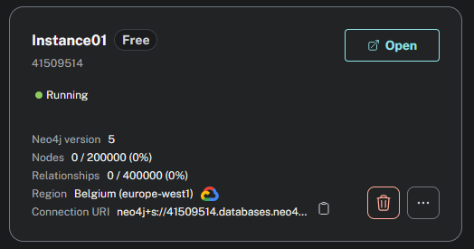
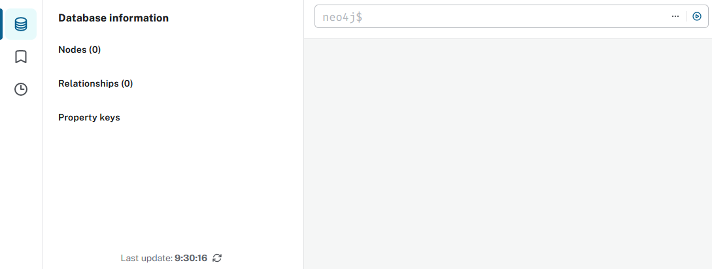
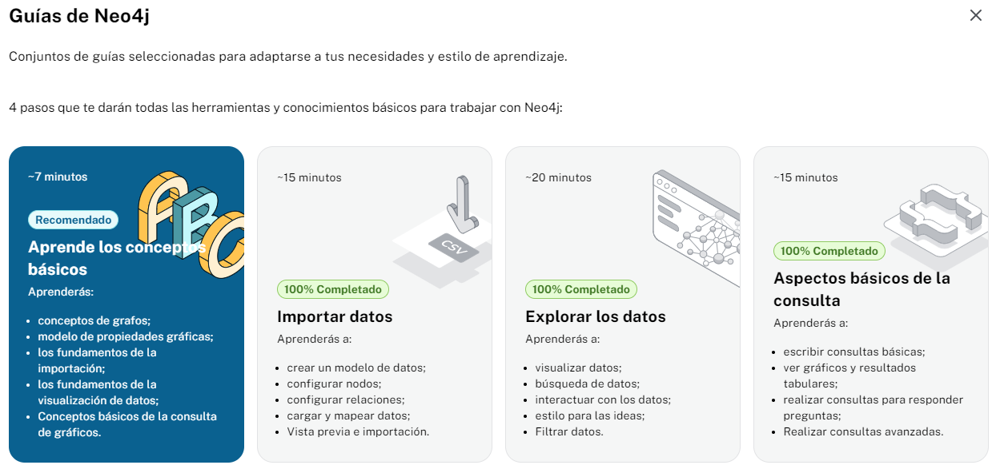
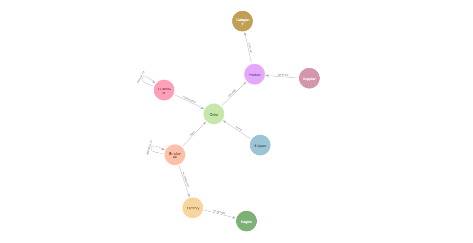
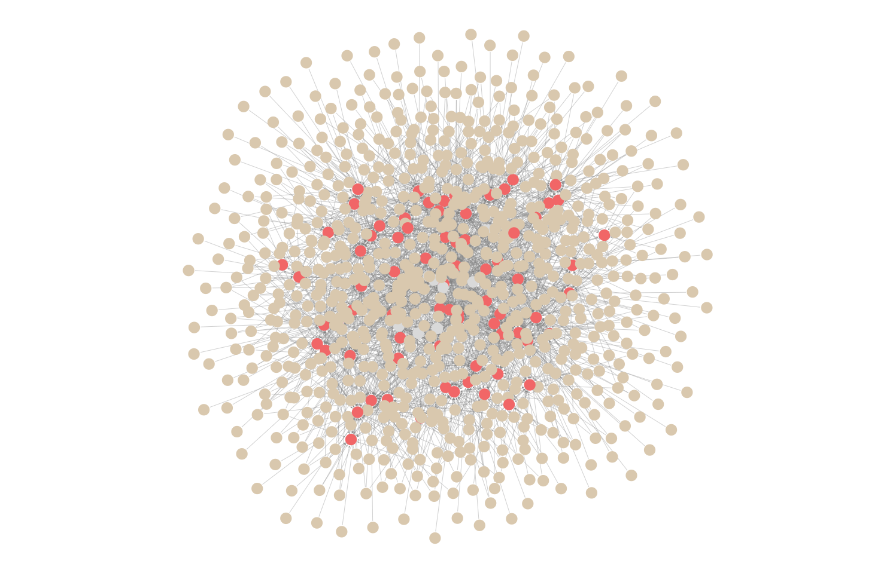

# Introducción a Neo4J y a las bases de datos orientadas a grafos

Con este ejercicio buscamos crear una base de datos orientada a grafos y realizar operaciones sobre ella.

Elige un caso de uso de tu elección y crea una base de datos Neo4J usando [Neo4J Aura DB](https://console.neo4j.io) Se te pedirá registrarte en la aplicación. Puedes crear una cuenta o utilizar una ya existente a través de Google, Linkedin...

Como en otras ocasiones, necesitaremos datos de prueba. Para facilitar esta tarea, puedes hacer uso de ChatGPT como ya hicimos anteriormente para generar un archivo con los datos de prueba.

También puedes importar [datos de prueba de Twitter](https://github.com/neo4j-graph-examples/twitter-v2). Ten en cuenta que la operación de importación de datos desde Neo4J Aura DB puede tardar unos minutos. Para importar datos simplemente tienes que utilizar la opción "Import Database" de la consola y seleccionar el fichero de backup obtenido del repositorio anterior (carpeta data/).

## 1. Ejercicio

### Parte I) Creación de la instancia de Neo4J

<i>Instancia creada</i>

### Parte II) Conexión a la instancia de Neo4J

<i>Instancia vacía</i>

### Parte III) Completa las cuatro guías de Neo4J 

<i>Captura de pantalla de las guías completadas</i>

<i>Esquema del Gráfico final</i>

<i>Relaciones entre los nodos: Product, Order y Category</i>

