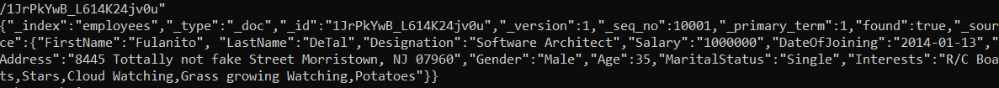
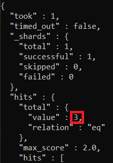
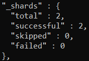

# Ejercicio 10 Yago Nieto Garrido
Todos los comandos aqui expuestos son para una máquina con Windows. Si se quieren probar en una máquina con Linux o MacOS habria que cambiar las comillas dobles que encampsulan (") por comillas simples (').


## Parte I) Generar un alias
- Genera un alias para el indice employees, que se llamará employees-alias. A partir de ahora realizaremos las consultas siempre sobre este alias y no sobre el índice original.

     ``` 
    curl -XPOST "<<host_obtenido_de_bonsai>>/_aliases" -H "Content-Type: application/json" -d "{\"actions\": [ {\"add\":{\"index\": \"employees\",\"alias\": \"employees-alias\"} }]}"
     ```


## Parte II) Inserción de elementos
- Inserta un nuevo elemento en el índice utilizando tus datos (puedes inventartelos si lo consideras). Guarda el ID de documento  que has obtenido tras la creacion del elemento.

     ``` 
    curl -XPOST "<<host_obtenido_de_bonsai>>/employees-alias/_doc" -H "Content-Type: application/json" -d "{\"FirstName\":\"Fulanito\", \"LastName\":\"DeTal\",\"Designation\":\"Software Architect\",\"Salary\":\"1000000\",\"DateOfJoining\":\"2014-01-13\",\"Address\":\"8445 Tottally not fake Street Morristown, NJ 07960\",\"Gender\":\"Male\",\"Age\":35,\"MaritalStatus\":\"Single\",\"Interests\":\"R/C Boats,Stars,Cloud Watching,Grass growing Watching,Potatoes\"}"
     ```
    {"_index":"employees","_type":"_doc",
    
    "_id":"1JrPkYwB_L614K24jv0u",
    
    "_version":1,"result":"created","_shards":{"total":2,"successful":2,"failed":0},"_seq_no":10001,"_primary_term":1}

## Parte III) Obtención simple de elementos
- Utilizando el ID del paso anterior, obtén los datos de tu registro. Deberías obtener lo mismo que anteriormente escribiste.

     ``` 
    curl -XGET "<<host_obtenido_de_bonsai>>/employees-alias/_doc/1JrPkYwB_L614K24jv0u" 
     ```
    

## Parte IV) Eliminación de elementos
- Elimina el elemento que has creado anteriormente.

     ``` 
    curl -XDELETE "<<host_obtenido_de_bonsai>>/employees-alias/_doc/1JrPkYwB_L614K24jv0u" 
     ```


## Parte V) Consultas
- Obtener empleados cuyo puesto sea Software Engineer.

     ``` 
    curl -XGET "<<host_obtenido_de_bonsai>>/employees-alias/_search?pretty"  -H "Content-Type: application/json" -d "{ \"query\": { \"term\": { \"Designation\":{\"value\": \"Software Engineer\", \"boost\": 1.0 } } } }" 
     ```


- Obtener empleados cuyo puesto NO sea Software Engineer.

     ``` 
    curl -XGET "<<host_obtenido_de_bonsai>>/employees-alias/_search?pretty"  -H "Content-Type: application/json" -d "{ \"query\": { \"bool\" : { \"must_not\" :  { \"term\": { \"Designation\":{\"value\": \"Software Engineer\", \"boost\": 1.0 } } } } } }" 
     ```


- Obtener la primera página de empleados cuya designation sea Software Engineer asumiendo un tamaño de página de 35 elementos. 

     ``` 
    curl -XGET "<<host_obtenido_de_bonsai>>/employees-alias/_search?pretty"  -H "Content-Type: application/json" -d "{ \"from\": 0, \"size\": 35, \"query\": { \"term\": { \"Designation\":{\"value\": \"Software Engineer\", \"boost\": 1.0 } } } }" 
     ```


- Obtener la tercera página de empleados cuya designation sea Software Engineer asumiendo un tamaño de página de 35 elementos.

     ``` 
    curl -XGET "<<host_obtenido_de_bonsai>>/employees-alias/_search?pretty"  -H "Content-Type: application/json" -d "{ \"from\": 70, \"size\": 35, \"query\": { \"term\": { \"Designation\":{\"value\": \"Software Engineer\", \"boost\": 1.0 } } } }" 
     ```


- Obtener los primeros 13 empleados cuyo salario sea mayor a 67.000 dólares. 

     ``` 
    curl -XGET "<<host_obtenido_de_bonsai>>/employees-alias/_search?pretty"  -H "Content-Type: application/json" -d "{ \"from\": 0, \"size\": 13, \"query\": { \"range\": { \"Salary\":{\"gt\": 67000, \"boost\": 2.0 } } } }" 
     ```


- Obtener el número total que hayan entrado en la empresa en el mes de Mayo del año 2003. No se pide una consulta específica, solo saber el número total de hits. (3)

     ``` 
    curl -XGET "<<host_obtenido_de_bonsai>>/employees-alias/_search?pretty"  -H "Content-Type: application/json" -d "{ \"from\": 0, \"size\": 13, \"query\": { \"range\": { \"DateOfJoining\":{\"gte\": \"2003-03-01\",\"lte\": \"2003-03-31\", \"boost\": 2.0 } } } }
     ```
     


- Obtener empleados cuyo nombre sea NATALIE.

     ``` 
    curl -XGET "<<host_obtenido_de_bonsai>>/employees-alias/_search?pretty"  -H "Content-Type: application/json" -d "{ \"query\": { \"match\": {\"FirstName\": \"NATALIE\"} } } " 
     ```

- Obtener empleados cuya dirección sea o contenga Street.

     ``` 
    curl -XGET "<<host_obtenido_de_bonsai>>/employees-alias/_search?pretty"  -H "Content-Type: application/json" -d "{ \"query\": { \"multi_match\": { \"query\": \"Street\", \"fields\": [ \"Interests\", \"Address._2gram\", \"Address._3gram\"] } } } " 
     ```


- Obtener empleados cuya dirección sea o contenga wood.

     ``` 
    curl -XGET "<<host_obtenido_de_bonsai>>/employees-alias/_search?pretty"  -H "Content-Type: application/json" -d "{ \"query\": { \"multi_match\": { \"query\": \"wood\", \"fields\": [ \"Address\", \"Address._2gram\", \"Address._3gram\"] } } } "  
     ```

- Obtener empleados interesados en Wrestling.

     ``` 
    curl -XGET "<<host_obtenido_de_bonsai>>/employees-alias/_search?pretty"  -H "Content-Type: application/json" -d "{ \"query\": { \"multi_match\": { \"query\": \"Wrestling\", \"fields\": [ \"Interests\", \"Interests._2gram\", \"Interests._3gram\"] } } } "  
     ```


- Obtener el número de hombres y mujeres interesad@s en Wrestling.

     ``` 
    curl -XGET "<<host_obtenido_de_bonsai>>/employees-alias/_search?pretty"  -H "Content-Type: application/json" -d "{ \"size\": 0,\"query\": { \"multi_match\": {  \"query\": \"Wrestling\", \"fields\": [ \"Interests\", \"Interests._2gram\", \"Interests._3gram\"] } }, \"aggs\" : { \"genres\": { \"terms\": { \"field\": \"Gender\", \"order\": { \"_count\": \"asc\" } } } } } "  
     ```


- En base a la consulta anterior, obtener la edad media de cada grupo (grupo hombres y grupo mujeres). 

     ``` 
    curl -XGET "<<host_obtenido_de_bonsai>>/employees-alias/_search?pretty"  -H "Content-Type: application/json" -d "{ \"size\": 0,\"query\": { \"multi_match\": {  \"query\": \"Wrestling\", \"fields\": [ \"Interests\", \"Interests._2gram\", \"Interests._3gram\"] } }, \"aggs\" : { \"genres\": { \"terms\": { \"field\": \"Gender\", \"order\": { \"_count\": \"asc\" } } ,\"aggs\":{\"Average age\":{\"avg\":{\"field\":\"Age\"} } } } } } " 
     ```


- Obtener el número de empleados en función de los siguientes tramos de salario: menor de 60.000 dólares (tramo 1), entre 60.000 dólares y 67.000 dólares (tramo 2) y superior a 67.000 dólares (tramo 3). 

     ``` 
    curl -XGET "<<host_obtenido_de_bonsai>>/employees-alias/_search?pretty"  -H "Content-Type: application/json" -d "{ \"size\": 0,\"aggs\" : {\"salary_ranges\": {\"range\": {\"field\": \"Salary\", \"ranges\": [ { \"to\": 60000 }, { \"from\": 60001, \"to\": 66999 }, { \"from\": 67000 } ] } } } } "  
     ```


- En base a la consulta anterior, para cada tramo, hallar el número de empleados que están casados y no casados.

     ``` 
    curl -XGET "<<host_obtenido_de_bonsai>>/employees-alias/_search?pretty"  -H "Content-Type: application/json" -d "{ \"size\": 0,\"aggs\" : {\"salary_ranges\": {\"range\": {\"field\": \"Salary\", \"ranges\": [ { \"to\": 60000 }, { \"from\": 60001, \"to\": 66999 }, { \"from\": 67000 } ] } ,\"aggs\": { \"marital\": { \"terms\": { \"field\": \"MaritalStatus\", \"order\": { \"_count\": \"asc\" } } } } } } } "  
     ```


---

## Parte VI) Crear otro índice y modificar el alias
- Crea un nuevo índice de la misma forma que hiciste al principio, pero ahora llámalo employees-v2 y mete en él todos los datos del fichero de prueba. Modifica el alias employees-alias que creaste antes para que apunte tanto al índice employees original como al nuevo employees-v2. Puedes comprobar que lo has hecho correctamente ejecutando la operación "Obtener todos los alias" de la colección de Postman.

     ``` 
    curl -XPUT "<<host_obtenido_de_bonsai>>/employees-v2" 

    curl -XPUT "<<host_obtenido_de_bonsai>>/employees-v2/_bulk" --data-binary @Employees_raw.json -H "Content-Type: application/json"

    curl -XPOST "<<host_obtenido_de_bonsai>>/_aliases" -H "Content-Type: application/json" -d "{\"actions\": [ {\"add\":{\"index\": \"employees-v2\",\"alias\": \"employees-alias\"} }]}"
     ```


- Realiza alguna de las consultas anteriores. ¿Qué observas?

     Obtiene la información de los dos shards.

     

- Elimina employees del conjunto de índices a los que hace referencia el alias.

     ``` 
    curl  -XPOST "<<host_obtenido_de_bonsai>>/_aliases" -H "Content-Type: application/json" -d "{\"actions\" : [ { \"remove\" : { \"index\": \"employees\", \"alias\": \"employees-alias\" } } ] }"
     ```

