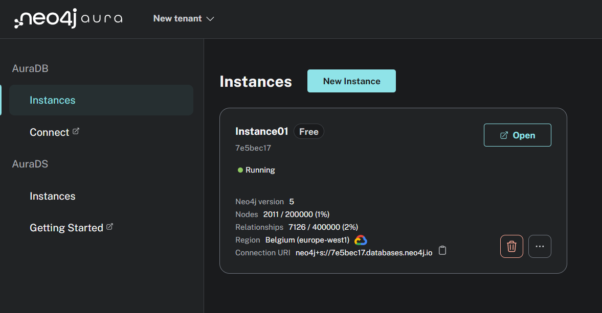
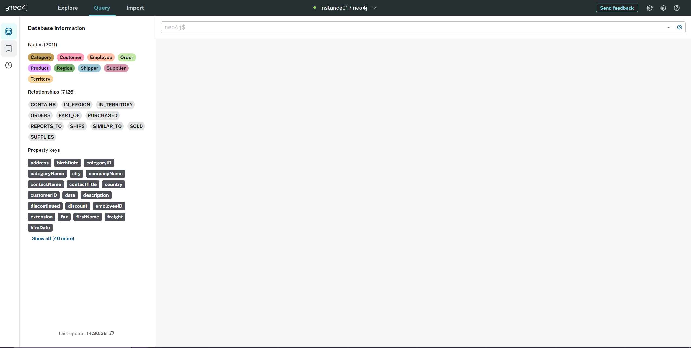
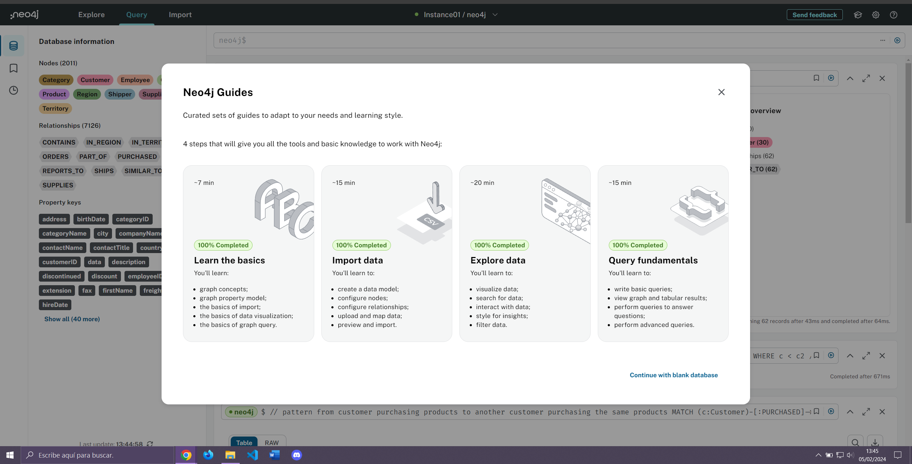
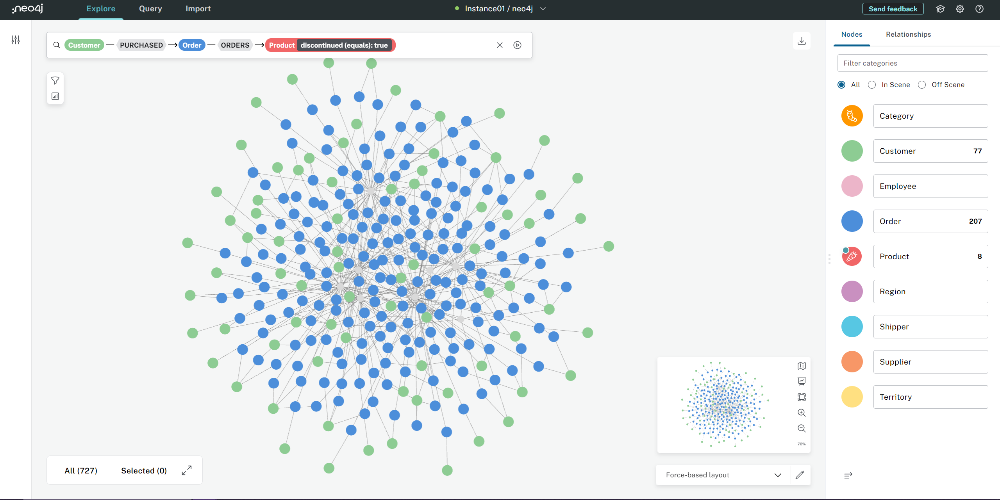

# Introducción a Neo4J y a las bases de datos orientadas a grafos

Con este ejercicio buscamos crear una base de datos orientada a grafos y realizar operaciones sobre ella.

Elige un caso de uso de tu elección y crea una base de datos Neo4J usando [Neo4J Aura DB](https://console.neo4j.io)

## 1. Ejercicio

### Parte I) Creación de la instancia de Neo4J

Crea una nueva instancia vacía desde Neo4J Aura DB. Puedes elegir la versión de Neo4J que prefieras. En el proceso se te facilitará una contraseña para acceder a la base de datos. Descarga el archivo y guárdalo.

### Parte II) Conexión a la instancia de Neo4J

Haz click en el botón "Open" de tu instancia para acceder a la consola de Neo4J. Se te pedirá la contraseña que se te facilitó en el paso anterior. Una vez dentro, la base de datos estará vacía.

### Parte III) Completa las cuatro guías de Neo4J

En la parte superior derecha de la pantalla verás, un icono de un birrete de graduación. Haz click para acceder a las cuatro guías de Neo4J.

Todos los clilentes que han ordenado un producto descontinuado (los productos descontinuados estan en gri y no en rojo, por una regla de visualización)

Estas guías están diseñadas para introducir a los usuarios en el uso de Neo4J. Cada guía tiene una serie de pasos que deberás completar. Todo el proceso es guiado y te ayudará a afianzar los conocimientos sobre Neo4J.
